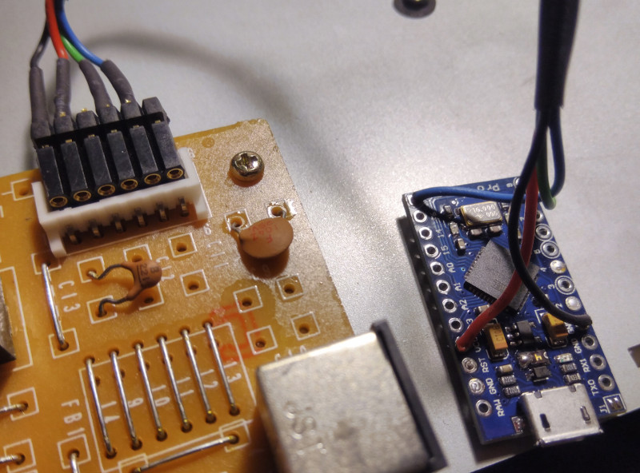

# *suniversal*

A USB adapter for *SUN Type 5* keyboards, based on *Arduino Pro Micro*. All keys working!


## Background
A couple of years back, I bought a *SUN Type 5* keyboard at the *VCFe* flea market, put it in the attic and forgot about it. A few days ago, it fell into my hands again while looking for something, and I thought it would be nice to make use of it. After cleaning it thoroughly, I considered the available options for connecting it to my Linux box. There are a few older projects, such as [here](http://ezhid.sourceforge.net/sunkbd.html), [here](http://snafu.priv.at/mystuff/sunkbd.html), and [here](http://kentie.net/article/sunkbd/), but they seemed too involved on the hardware side (require creating a PCB), compared to how cheap, small, and complete for example an *Arduino Pro Micro* board is. So, for the *Arduino* world, the best solution out there seemed to be Ben Rockwood's [SunType5_ArduinoAdapter](https://github.com/benr/SunType5_ArduinoAdapter), the only problem being that it does not make all keys available. Still good enough as a starting point.


## Hardware
I finally settled for the *Arduino Pro Micro*. The *Micro* may also work, but I haven't tested that. Whichever board you choose, make sure it's 5V, since the RS232 signals from the keyboard are 5V TTL levels! I decided to put the *Arduino* into the keyboard case (had to open it for cleaning anyway). The original cable can be unplugged from the keyboard's PCB, so it's easy to revert the modification should I ever desire to do so. The only thing to fabricate was a very simple harness to connect the *Arduino* with the PCB:

| PCB pin | wire color* | function   | *Arduino* pin  |
|---------|-------------|------------|----------------|
|     1   |    black    |   GND      |      GND       |
|     2   |    red      |   +5V      |      Vcc       |
|     4   |    brown    |  serial TX (to KBD)   | D9  |
|     5   |    blue     |  serial RX (from KBD) | D10 |

*as found on a Type 5c keyboard, may differ depending on model & year

The most challenging part may be finding the right plug to connect to the PCB. I fabricated something out of a connector that had the right pitch.




## Software

Analyzing *SunType5_ArduinoAdapter*, I realized that the limitations were rooted in the use of the *Arduino* Keyboard library for the conversion to USB. Not that the library itself is in any way limited, it's just that it is designed for a different use case - turning `Print`ed characters into key strokes. But what we need here is actually much simpler - just a plain scan code converter. So I merged *SunType5_ArduinoAdapter* and the Keyboard library and started refactoring the code. The result is this project.

#### Configuration
There are a few settings you can make in `suniversal.h`, the more interesting ones being:

- `USE_MACROS` - When enabled, this assigns *macros* (short key stroke sequences) instead of the single USB key codes, to the special keys in the fun cluster (the eleven keys on the left). This is because mostly, those don't seem to have any effect unless you make according settings in the OS. So instead of sending e.g. USB_COPY, USB_CONTROL and USB_C will be sent. To add your own macros, have a look at `macros.cpp`. Macros are enabled by default.

- `NUM_LOCK_ON` - This determines whether NumLock will be on or off after power on. Defaults to on.

- `DEBUG` - You can enable debug mode with this, which will put diagnostic messages on the serial port. Additionally, the power key will turn into a reset button for the keyboard, so it's easier to observe start up messages. This is off by default.


## Gotchas

- Code translations were set to the same USB scan codes that a *SUN Type 7* keyboard sends. However, whether special keys such as the audio and power keys have the desired result depends on your OS. You may have to configure it accordingly. On my *Ubuntu* box for example, I configured keyboard shortcuts for the audio and power keys in the keyboard settings. The keys in the fun cluster (*Stop*, *Again*, *Undo* etc.) have macros assigned by default, so they should work without making any settings, unless you turn macros off.

- The Compose key should by default invoke context menus, and the LED will not light up. If you're assigning this key on the host to invoke actual compose mode, have a look at the `COMPOSE_MODE` setting to get the LED working.

- The keyboard cannot receive commands from the host, since the *Arduino* HID library currently does not support that. However, that should only mean that if the host wants to change the state of the keyboard LEDs, then that won't be reflected. For example, when you're using a second keyboard and press *Caps Lock* on it, the *Caps Lock* LED on the SUN keyboard won't light up. But why would you use another keyboard when you have your Type 5 right in front of you... ;-)


## Development

- When developing a new feature or checking on an issue, turning on debug mode (see above) may be helpful.

- To see what scan codes reach the host, use `xev` on Linux systems.

- Uploading the code to an *Arduino Pro Micro* can be tricky. Sometimes, you just have to try several times. On a Linux system, I noticed that things improve somewhat if you explicitly exclude your *Arduino* board in `udev`: Find out the vendor IDs of the board with `lsusb`. The *Pro Micro* has two - one when in normal mode, and a different one when in upload mode. When you have the IDs, create `/etc/udev/rules.d/77-arduino.rules` with the following contents:

    ```
    ATTRS{idVendor}=="2341", ENV{ID_MM_DEVICE_IGNORE}="1"
    ATTRS{idVendor}=="1b4f", ENV{ID_MM_DEVICE_IGNORE}="1"
    ```

    Replace the vendor IDs with the ones from your board. Then, run `sudo udevadm trigger`.


## Contributing

If you find any bugs or have ideas for new features, I'd be happy to receive your issues or pull requests. Also, currently I only have the German version of the keyboard, so I can only test with that one. Feedback about whether everything works with other layouts as intended would be very welcome.


## Resources

- [SUN 5 Keyboard spec](http://sparc.org/wp-content/uploads/2014/01/KBD.pdf.gz)
