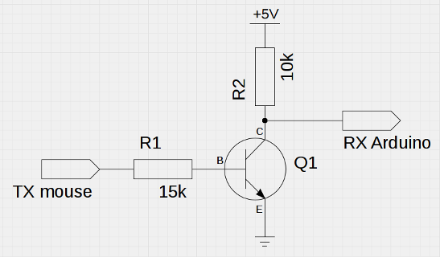
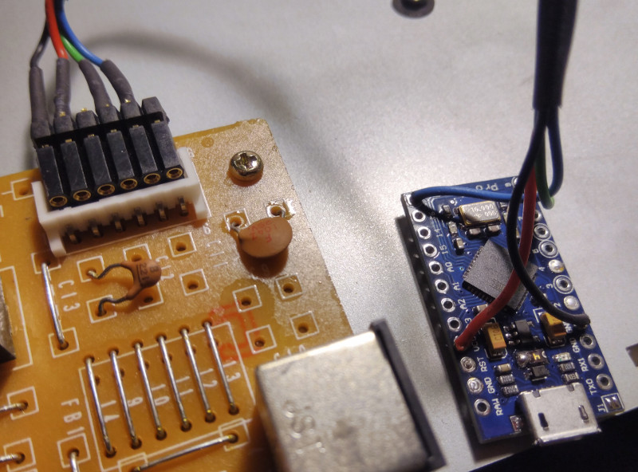
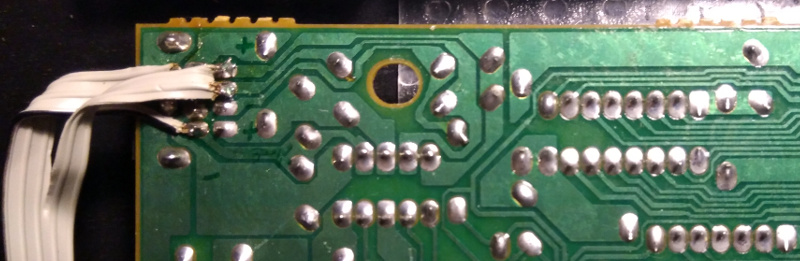
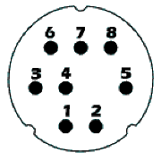

# *suniversal*


## TL;DR

*suniversal* is a USB adapter for *SUN Type 5* keyboards. It is developed on an *Arduino Pro Micro*, but other boards based on the *ATmega32u4* micro-controller should work as well.

#### What's New
I finally got hold of *SUN* mouse (model *Compact 1*, *SUN* no. 370-1586-03), so I could test and adapt my initial implementation for mouse support.

#### Features
- all keys working
- boot protocol supported, i.e. works in BIOS
- keyboard LEDs controlled by host
- mouse support

#### Compatibility
| keyboard | status                                   |
|----------|------------------------------------------|
| Type 5c  | confirmed working                        |
| Type 5   | confirmed working                        |
| Type 4   | feedback wanted                          |
| Type 3   | feedback wanted                          |


## Background

A couple of years back, I bought a *SUN Type 5c* keyboard at the *VCFe* flea market, put it in the attic and forgot about it. A few days ago, it fell into my hands again while looking for something, and I thought it would be nice to make use of it. After cleaning it thoroughly, I considered the available options for connecting it to my Linux box. There are a few older projects, such as [here](http://ezhid.sourceforge.net/sunkbd.html), [here](http://snafu.priv.at/mystuff/sunkbd.html), and [here](http://kentie.net/article/sunkbd/), but they seemed too involved on the hardware side (require creating a PCB), compared to how cheap, small, and complete for example an *Arduino Pro Micro* board is. So, for the *Arduino* world, the best solution out there seemed to be Ben Rockwood's [SunType5_ArduinoAdapter](https://github.com/benr/SunType5_ArduinoAdapter), the only problem being that it does not make all keys available. Still good enough as a starting point.


## Hardware

I finally settled for the *Arduino Pro Micro*. The *Micro* may also work, but I haven't tested that. Whichever board you choose, make sure it's 5V, since the RS232 signals from the keyboard are 5V TTL levels! Shortly after starting this project, I also got my hands on a *Type 5* in addition to the *Type 5c* I already had. For both, I decided to put the *Arduino* into the keyboard case (had to open them for cleaning anyway). The hardware is different for both, so here's how I went about it.

### *Type 5c*

The original cable can be unplugged from the keyboard's PCB, so it's easy to revert the modification should I ever desire to do so. The only thing to fabricate was a very simple harness to connect the *Arduino* with the PCB:

| PCB pin | wire color<sup>1</sup>|function| *Arduino* pin |
|---------|-------------|------------|---------------------|
|     1   |    black    |   GND      |      GND            |
|     2   |    red      |   +5V      |      Vcc            |
|     3   |    green    |  serial RX (from mouse)    | RX<sup>2</sup>|
|     4   |    brown    |  serial TX (to keyboard)   | D9  |
|     5   |    blue     |  serial RX (from keyboard) | D10 |

<sup>1</sup> as found on a *Type 5c* keyboard, may differ depending on model & year

#### <sup>2</sup> Inverter for Mouse Signal
Just like the keyboard, the mouse also uses an inverted serial signal, so you need an inverter in the line between the mouse and RX of the *Arduino*, e.g. a transistor and two resistors. This is because unlike the `SoftwareSerial` we're using for the keyboard, the H/W serial of the *Arduino* cannot be configured to invert signals. Alternatively, maybe a second `SoftwareSerial` could be used, but I was under the impression that only one would work at a time. Let me know if that's not so.



If you're not planning on using the mouse, you can skip this of course. The most challenging part may be finding the right plug to connect to the PCB. I fabricated something out of a connector that had the right pitch:



### *Type 5*

Here, the keyboard cable is not fixed, but plugged into one of the external connectors on either side of the keyboard. There's no internal connector on the keyboard's PCB to which we could conveniently connect the *Arduino*. I therefore soldered the wires form the *Arduino* to one of the external connectors (I chose the left one), and stowed it away between the keyboard backplate and the PCB, wrapped into the little anti-static bag it came in for insulation.



To find out which pin is which signal, plug in the original cable and use a multimeter to map the pins of the cable plug to the pins of the socket on the solder side of the PCB. The pinout of the male Mini-DIN 8a plug is:



And here the mapping to the *Arduino* pins:

| plug pin | function | *Arduino* pin        |
|----------|----------|----------------------|
|     1    | GND      |      GND             |
|     2    | GND      |                      |
|     3    | +5V      |      Vcc             |
|     4    | serial RX (from mouse)    | RX<sup>1</sup> |
|     5    | serial TX (to keyboard)   | D9  |
|     6    | serial RX (from keyboard) | D10 |
|     7    | ?        |                      |
|     8    | +5V      |                      |

<sup>1</sup> see note in section for *Type 5c*

## Software

Analyzing *SunType5_ArduinoAdapter*, I realized that the limitations were rooted in the use of the *Arduino* Keyboard library for the conversion to USB. It's designed for a different use case - turning `Print`ed characters into key strokes. But what we need here is actually much simpler - just a plain scan code converter. So I merged *SunType5_ArduinoAdapter* and the Keyboard library and started refactoring and extending the code. Later on I switched from the *Arduino* core USB HID library to [NicoHood's HID project](https://github.com/NicoHood/HID) for the USB heavy lifting. This enabled support for boot protocol and control of the keyboard LEDs by the host. I then went on to extract the USB part from that library (it was really just one class that was actually needed), to keep dependencies down.

#### Configuration

There are a few settings you can make in `config.h`, the more interesting ones being:

- `USE_MACROS` - When enabled, this assigns *macros* (short key stroke sequences) instead of the single USB key codes, to the special keys in the fun cluster (the eleven keys on the left). This is because mostly, those don't seem to have any effect unless you make according settings in the OS. So instead of sending e.g. the USB_COPY code, USB_CONTROL followed by USB_C will be sent. To add your own macros, have a look at `macros.cpp`. Macros are enabled by default.

- `USE_MOUSE` - When enabled, the signals from a *SUN* mouse plugged into the keyboard will be forwarded to USB. Both 5-byte *Mousesystems* protocol and 3-byte *SUN* protocol are automatically handled. (To be on the safe side, don't hot-plug the mouse.)

- `DEBUG` - You can enable debug mode with this, which will put diagnostic messages on the serial port. Additionally, the power key will turn into a reset button for the keyboard, so it's easier to observe start up messages. This is off by default.


## Gotchas

- Code translations were set to the same USB scan codes that a *SUN Type 7* keyboard sends (the *Type 7* is USB native). However, whether special keys such as the audio and power keys have the desired result depends on your OS. You may have to configure it accordingly. On my *Ubuntu* box for example, I configured keyboard shortcuts for the audio and power keys in the keyboard settings. The keys in the fun cluster (*Stop*, *Again*, *Undo* etc.) have macros assigned by default, so they should work without making any settings, unless you turn macros off.

- The Compose key should by default invoke context menus, and the LED will not light up. If you're assigning this key on the host to invoke actual compose mode, have a look at the `COMPOSE_MODE` setting to get the LED working.

- Boot protocol is supported, so you can use the keyboard when in BIOS or boot loader. Depending on the particular host machine and its BIOS however, that may not fully work as expected. For example, on one laptop I'm using, the keyboard was very sluggish in *Grub*. What helped here was adding `GRUB_TERMINAL_INPUT="usb_keyboard at_keyboard console"` in `/etc/default/grub`, followed by `sudo update-grub`. A word of caution, though: When you mess around with the *Grub* config, have something like [Super Grub2 Disk](https://www.supergrubdisk.org/super-grub2-disk/) handy in case you break it and can't boot into your system any longer. I've been there... ;-)


## Development

- When developing a new feature or checking on an issue, turning on debug mode (see above) may be helpful.

- To see what scan codes reach the host, use `xev` on Linux systems.

- Uploading the code to an *Arduino Pro Micro* can be tricky. Sometimes, you just have to try several times. On a Linux system, I noticed that things improve somewhat if you explicitly exclude your *Arduino* board in `udev`: Find out the vendor IDs of the board with `lsusb`. The *Pro Micro* has two - one when in normal mode, and a different one when in upload mode. When you have the IDs, create `/etc/udev/rules.d/77-arduino.rules` with the following contents:

    ```
    ATTRS{idVendor}=="2341", ENV{ID_MM_DEVICE_IGNORE}="1"
    ATTRS{idVendor}=="1b4f", ENV{ID_MM_DEVICE_IGNORE}="1"
    ```

    Replace the vendor IDs with the ones from your board. Then, run `sudo udevadm trigger`.


## Contributing

If you find any bugs or have ideas for new features, I'd be happy to receive your issues or pull requests. Also, currently I only have the German version of the keyboard, so I can only test with that one. Feedback about whether everything works with other layouts as intended would be very welcome. I'd also love to know whether this works with a *Type 4* or *Type 3* keyboard. Seems like it should, but would be good to hear back whether it actually does.


## Resources

- [SPARC Keyboard spec](http://sparc.org/wp-content/uploads/2014/01/KBD.pdf.gz)
